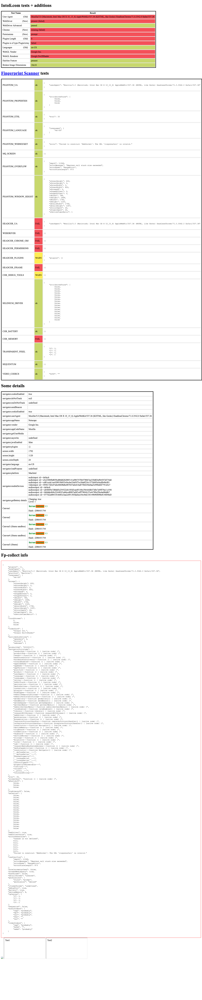
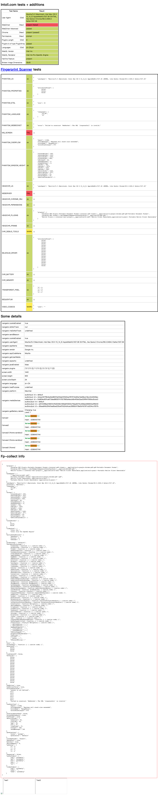
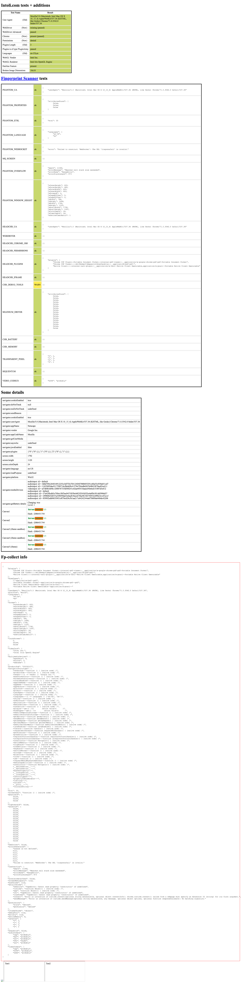
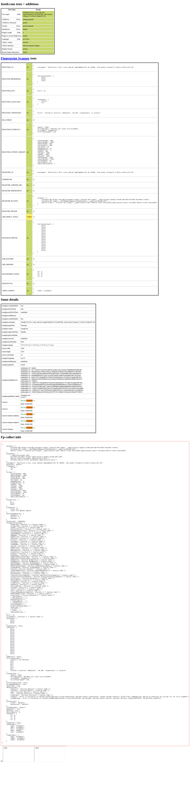

# pyppeteer-stealth

Transplanted from [puppeteer-extra-plugin-stealth](https://github.com/berstend/puppeteer-extra/tree/master/packages/puppeteer-extra-plugin-stealth), **Not perfect**.

## Install

```
$ pip install pyppeteer_stealth
```

## Usage

```python
import asyncio
from pyppeteer import launch
from pyppeteer_stealth import stealth

async def main():
    browser = await launch(headless=True)
    page = await browser.newPage()

    await stealth(page)  # <-- Here

    await page.goto("https://bot.sannysoft.com/")
    await browser.close()
asyncio.get_event_loop().run_until_complete(main())
```

## Test results

### Pyppeteer without stealth

<table class="image">
<tr>
  <td><figure class="image"><a href="headless_without_stealth.png"></a><figcaption>headless</figcaption></figure></td>
  <td><figure class="image"><a href="headful_without_stealth.png"></a><figcaption>headful</figcaption></figure></td>
</tr>
</table>

### Pyppeteer with stealth

<table class="image">
<tr>
  <td><figure class="image"><a href="headless_with_stealth.png"></a><figcaption>headless</figcaption></figure></td>
  <td><figure class="image"><a href="headful_with_stealth.png"></a><figcaption>headful</figcaption></figure></td>
</tr>
</table>
